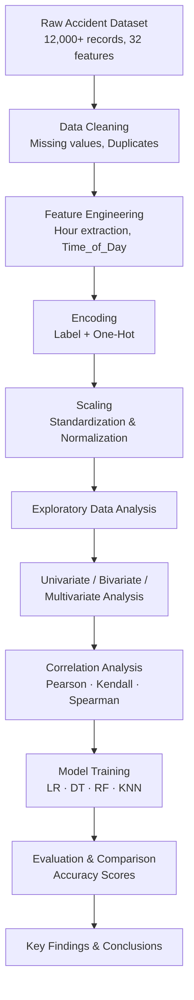

# Road Traffic Accident Severity Analysis & Prediction

> Exploring accident patterns and predicting severity using real-world traffic data from Ethiopia, making it end-to-end, from raw records to model evaluation.

---

## Overview

This project works through a complete data science pipeline on the [Ethiopian Road Traffic Accident Severity Dataset](https://www.kaggle.com/) from Kaggle, which is a real-world dataset with over 12,000 accident records and 32 features. The work covers systematic preprocessing, feature engineering, exploratory data analysis, and training multiple classification models to predict accident severity.

The emphasis throughout is on understanding *why* accidents happen and *what factors* make them more severe, rather than just optimizing a metric.

---

## Problem Statement

Road traffic accidents are a major public safety issue, and understanding what drives severity, not just frequency, is a step toward more targeted interventions. This project asks: given information about the driver, the vehicle, road conditions, and timing, can we predict how severe an accident will be?

The objective is to evaluate how effectively accident severity can be predicted using driver, vehicle, environmental, and temporal factors.

---

## Features

- End-to-end preprocessing pipeline with time feature engineering
- Multiple encoding strategies (Label Encoding and One-Hot Encoding) applied appropriately per feature type
- Three correlation methods (Pearson, Kendall, Spearman) for a more complete look at feature relationships
- Univariate, bivariate, and multivariate EDA with visualizations
- Four classification models trained and compared on the same splits
- Clean model comparison with accuracy scores

---

## Project Workflow

---

## Tech Stack

| Library | Purpose |
|---|---|
| Python 3.x | Core language |
| Pandas | Data manipulation and feature engineering |
| NumPy | Numerical operations |
| Matplotlib | Base visualizations |
| Seaborn | Statistical and correlation plots |
| Scikit-Learn | Preprocessing, modeling, evaluation |

---

## Dataset

**Source:** [Ethiopian Road Traffic Accident Severity Dataset — Kaggle](https://www.kaggle.com/)

The dataset was collected from real accident records in Ethiopia. It includes driver demographics, vehicle information, road and light conditions, collision type, and a target variable indicating accident severity.

| Attribute | Detail |
|---|---|
| Records | 12,000+ accident entries |
| Features | 32 (mixed categorical and numerical) |
| Target | Accident severity (multi-class) |
| Origin | Real-world traffic reports, Ethiopia |

---

## Exploratory Data Analysis Highlights

EDA was structured across three levels — univariate, bivariate, and multivariate, with correlation analysis running across all three methods to cross-validate findings.

**Distribution Analysis**
- Severity classes are imbalanced, which was accounted for during preprocessing and model evaluation.
- Categorical features like `Day_of_week`, `Age_band_of_driver`, and `Cause_of_accident` showed strong variation across severity classes.

**Correlation Analysis**
- Pearson, Kendall, and Spearman coefficients were computed to handle both linear and rank-based relationships.
- `Number_of_casualties` showed the strongest relationship with accident severity across all three methods.

**Time-Based Patterns**
- Accident frequency peaked during evening hours (5 PM – 7 PM), consistent with high-traffic commute windows.
- Friday recorded the highest accident count among all weekdays.

**Driver & Vehicle Patterns**
- Drivers in the 18–30 age group were involved in the most accidents.
- Multi-vehicle collisions were associated with more severe outcomes compared to single-vehicle incidents.

---

## Machine Learning Models

Four classifiers were trained on the preprocessed dataset using the same train-test split. The goal was to compare how different model types handle the multi-class severity prediction task.

**Models used:**

- **Logistic Regression** — linear baseline; performed well despite its simplicity
- **Decision Tree Classifier** — interpretable but prone to overfitting; lowest accuracy among the four
- **Random Forest Classifier** — ensemble method; best overall performance
- **K-Nearest Neighbors (KNN)** — instance-based; competitive but sensitive to feature scaling

---

## Model Performance Comparison

| Model | Accuracy |
|---|---|
| 🥇 Random Forest | **83.79%** |
| 🥈 Logistic Regression | 83.65% |
| 🥉 K-Nearest Neighbors | 82.67% |
| Decision Tree | 74.99% |

Random Forest achieved the highest accuracy, though Logistic Regression came remarkably close, suggesting the decision boundaries in this dataset are reasonably linear once the features are encoded and scaled properly. The Decision Tree's lower score is likely a result of overfitting on training data without pruning.

---

## Key Insights

1. **Time of day matters.** Accidents spike between 5–7 PM, pointing to evening rush hour as a consistent high-risk window.
2. **Young drivers dominate accident records.** The 18–30 age group accounts for the most incidents,  a demographic pattern consistent with road safety data elsewhere.
3. **Casualty count is the strongest severity signal.** `Number_of_casualties` had the highest correlation with severity across all three correlation methods.
4. **Multi-vehicle collisions are more dangerous.** Accident type is a meaningful predictor of outcome severity.
5. **Fridays are the riskiest day of the week** in this dataset, which is possibly due to end-of-week fatigue or higher traffic volume.
6. **Logistic Regression is competitive here.** The small gap between LR and Random Forest (~0.14%) suggests the problem doesn't inherently require complex non-linear modeling once preprocessing is done well.

---

## Future Improvements

- Apply SMOTE or class-weight adjustments to handle class imbalance more rigorously
- Tune Random Forest hyperparameters (max depth, n_estimators) using GridSearchCV
- Add feature importance plots to identify top predictors clearly
- Try XGBoost or LightGBM for a gradient boosting comparison
- Build a simple Streamlit app to make severity prediction interactive

---

## Learning Outcomes

- Practiced building a preprocessing pipeline for a mixed-type, real-world dataset with missing values and categorical features
- Understood when to use Label Encoding vs One-Hot Encoding and why the choice matters for certain models
- Learned how Pearson, Kendall, and Spearman correlation methods differ and when each is appropriate
- Gained a clearer intuition for why ensemble models tend to outperform single estimators and when they don't
- Understood the importance of feature scaling for distance-based models like KNN

---

## Author

**Arnav**
B.Tech — Artificial Intelligence & Machine Learning
Symbiosis Institute of Technology, Pune

> Built as part of Data Processing and Exploratory Learning (DPEL) coursework. The focus was on solid preprocessing and honest model evaluation,  the kind of work that holds up when someone actually reads through the code.
